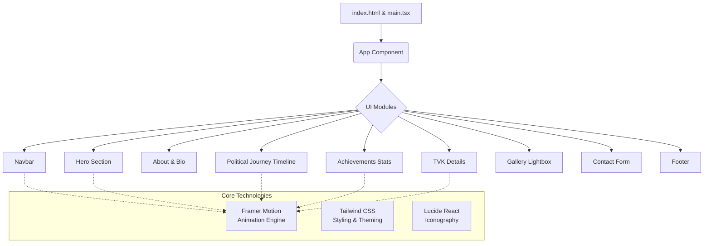

<div align="center">

# 🏛️ Bussy N. Anand — Political Digital Blueprint

**Official Portfolio & digital presence of Bussy N. Anand, General Secretary of Tamilaga Vettri Kazhagam (TVK)**

[](#)
[](#)
[](#)
[](#)
[](#)

A high-performance, aesthetically refined single-page application built to encapsulate the legacy, milestones, and vision of grassroots leadership in Tamil Nadu politics.

</div>

---

## 🎯 The Paradigm: Problem vs. Solution

### The Challenge
Traditional political websites often suffer from outdated UI, lack of responsive design, slow load times, and fail to evoke the cultural ethos and commanding presence required of modern statesmen. They lack the architectural sophistication to engage citizens effectively.

### The Blueprint Solution
We engineered a **Sophisticated Dark** themed interactive experience that harmonizes traditional Tamil aesthetics (Kolam patterns, Marigold/Saffron accents) with cutting-edge web technologies. 
- **High-Fidelity Animations:** Smooth scrolling, parallax effects, and intersection observers power an engaging narrative flow.
- **Enterprise Performance:** Built on Vite and React 19, lazy-loading assets, delivering a lightning-fast experience.
- **Responsive Architecture:** A mobile-first yet desktop-perfect grid system ensures universal accessibility across all devices.

---

## 🧠 Intelligence & Architecture

The application is structured as a modular React monolith, utilizing Framer Motion for declarative animations and Tailwind CSS for utility-first, theme-driven styling.



---

## 🎨 UI Layout & Thematic Engine

| Component | Design Metaphor | Technical Implementation |
| :--- | :--- | :--- |
| **Hero Setpiece** | The Command Center | Full viewport flexbox, dark gradients, animated text cycling (typewriter effect). |
| **Bilingual Navbar** | The Bridge | Sticky glassmorphism header with `backdrop-blur-md` and seamless Tamil/English toggle. |
| **Journey Timeline** | The Ascent | Vertical dynamic timeline, alternating staggered cards sliding in via `IntersectionObserver`. |
| **Achievement Grid** | The Ledger | Animated counters (custom easing functions), glowing hover states on metric cards. |
| **TVK Showcase** | The Movement | Expandable accordion UI, high-contrast dark foundation `#061026` with deep Gold accents. |

---

## ⚙️ Setup & Installation

Deploy the blueprint locally in seconds. This project uses `npm` and requires a Node.js environment.

### 1. Clone the Repository
```bash
git clone https://github.com/rahulcvwebsitehosting/Bussy-N.-Anand.git
cd Bussy-N.-Anand
```

### 2. Install Dependencies
Installs React, Vite, Tailwind, and Framer Motion dependencies.
```bash
npm install
```

### 3. Environment Config
Copy the example config to configure the local environment.
```bash
cp .env.example .env
```

### 4. Ignite the Server
Start the high-performance Vite dev server.
```bash
npm run dev
```
Navigate to `http://localhost:3000` to interact with the application.

### 5. Build for Production
To compile a highly optimized static bundle into the `dist/` directory:
```bash
npm run build
```

---

## 🤝 Connect & Collaborate

Architected and developed by **Rahul Shyam** (Lead Developer).

<div align="center">

[](https://bussynanand.vercel.app/)
[](https://linkedin.com/in/rahulshyamcivil)
[](https://github.com/rahulcvwebsitehosting/Bussy-N.-Anand)

</div>
